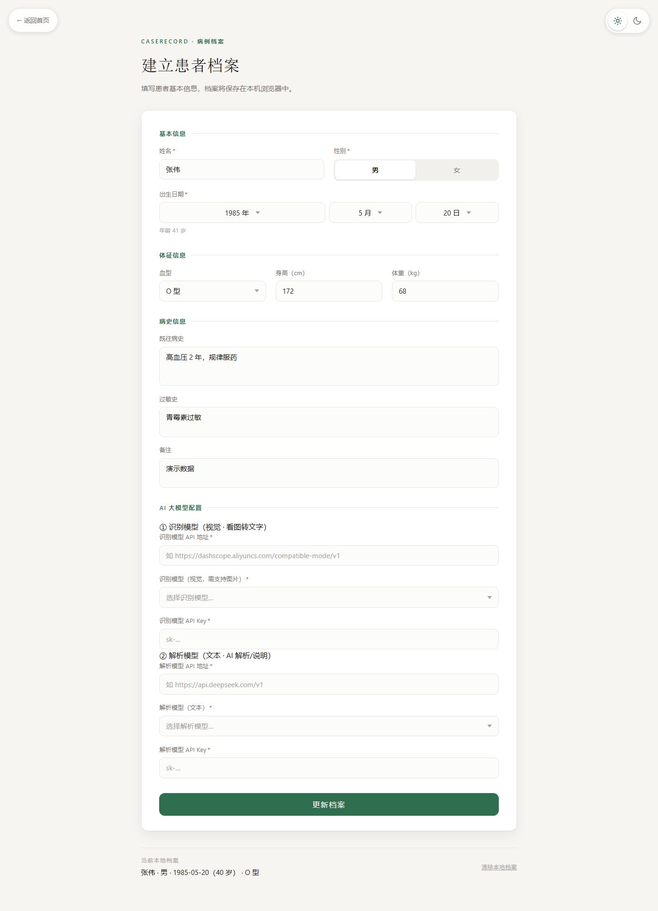
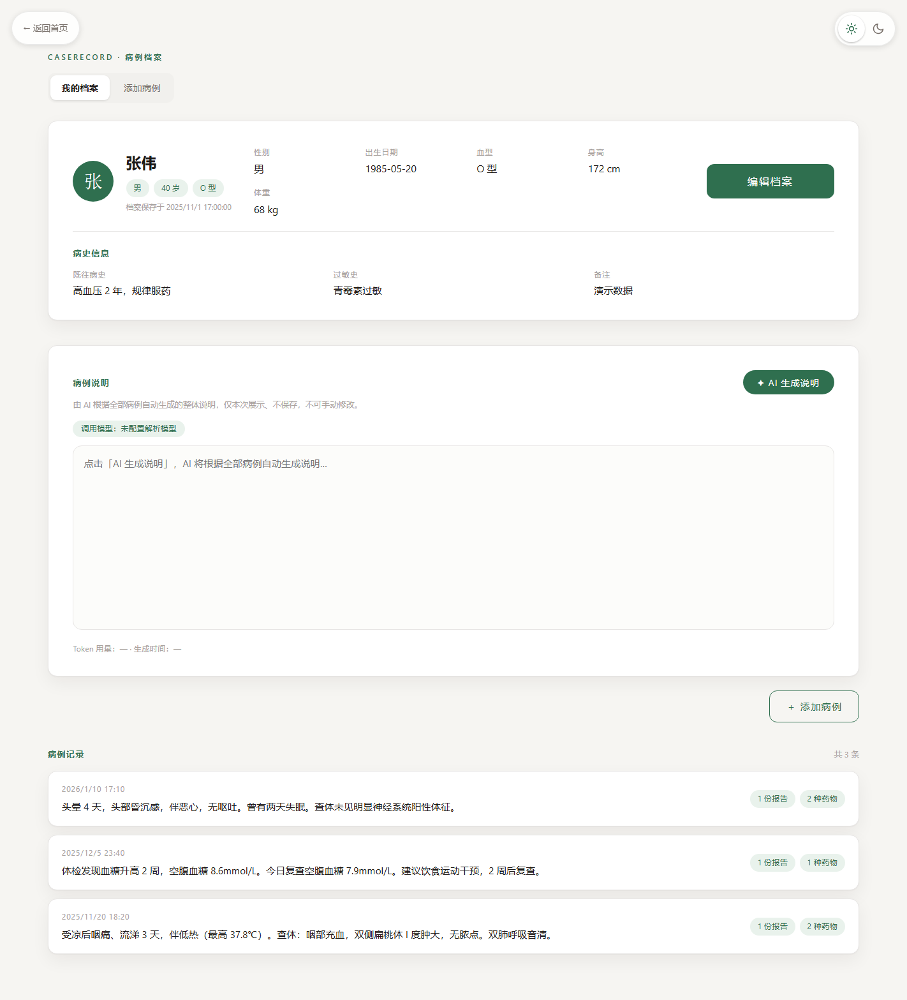
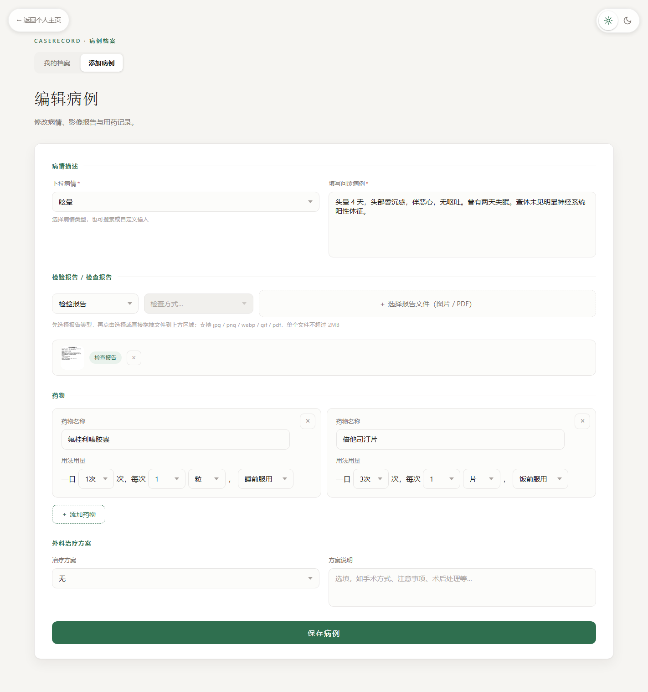
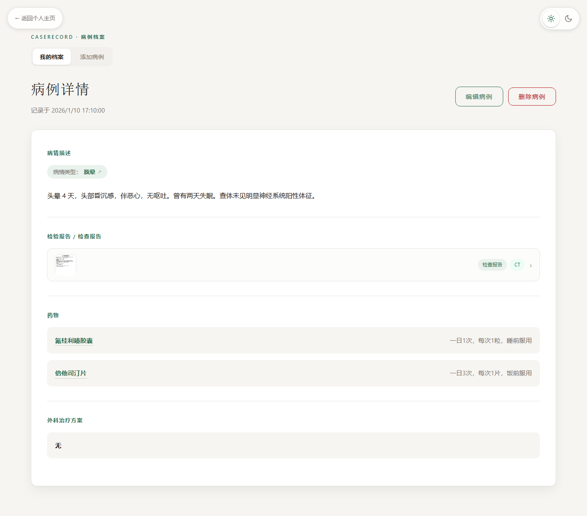
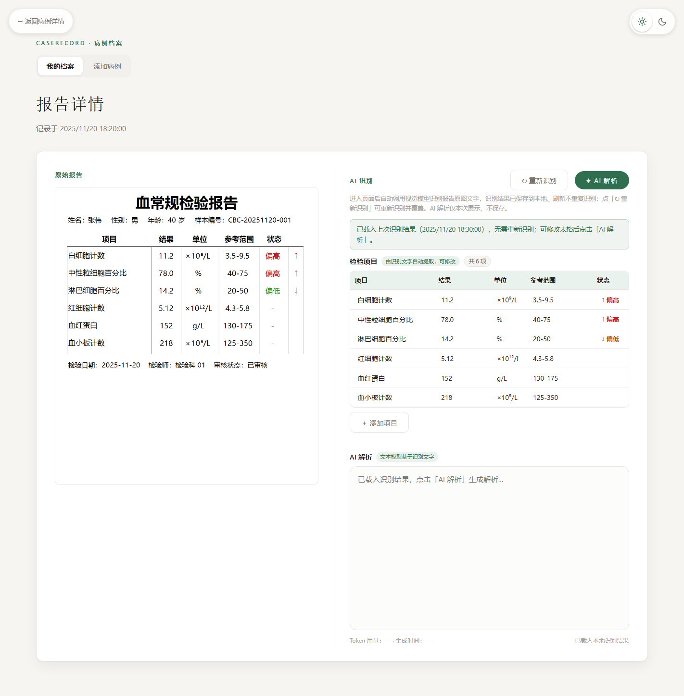
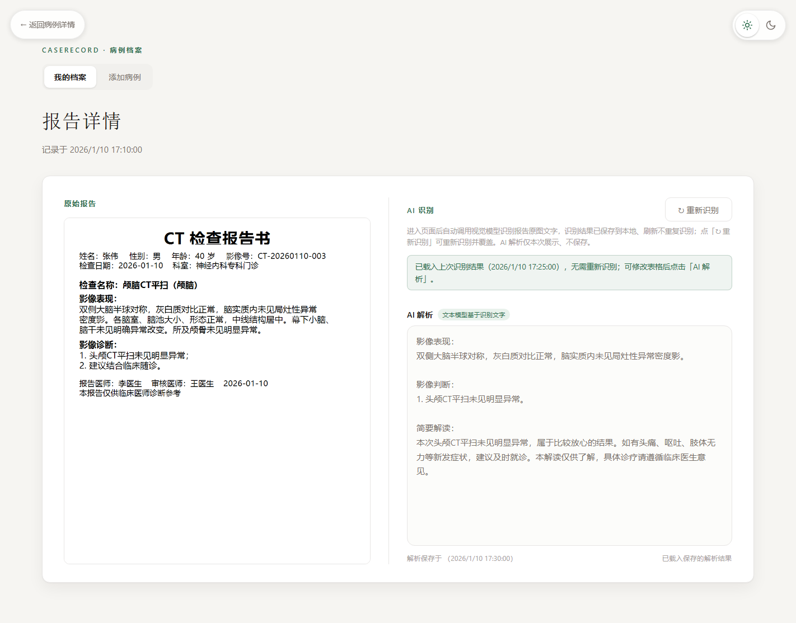
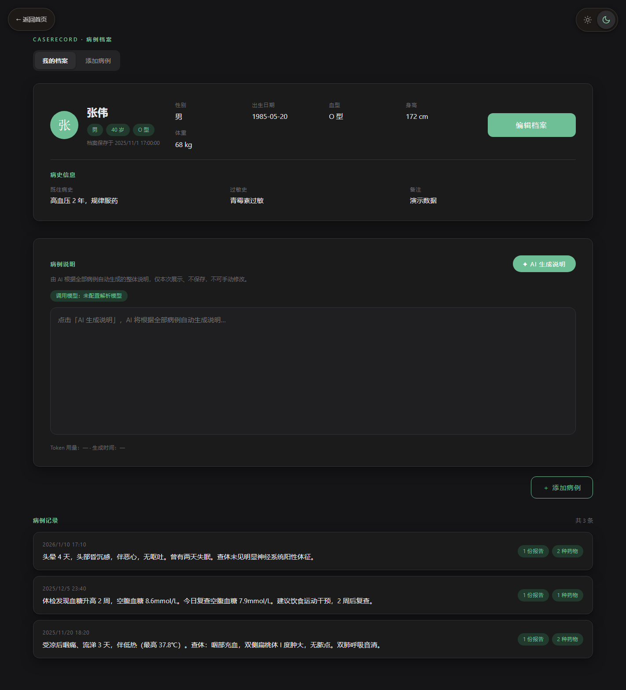

# CaseRecord · 病例档案

**语言 / Language：** [中文](#中文) | [English](#english)

---

## 中文

### 项目简介

**CaseRecord** 是一个**本地部署的个人医疗档案管理工具**：纯前端页面 + 本地 Python 服务器，数据全部保存在**你自己电脑上的 JSON 文件**中，不上传任何云端。

它帮助你把零散的就诊信息整理成册：

- 建立**患者个人档案**（基本信息、体征、病史）；
- 记录每一次就诊的**病情与问诊内容**；
- 上传**检验 / 检查报告**（图片或 PDF，支持拖拽）；
- 录入**用药清单**与**外科治疗方案**；
- 借助**大模型 AI**：视觉模型识别报告图片文字、文本模型解析报告并生成病例说明；
- 内置**浅色 / 深色主题**切换。

**技术基础：**

- 原生 HTML / CSS / JavaScript（无框架、无构建步骤）；
- Python 本地服务器（`server.py`，端口 **8081**）：静态文件服务 + REST API（档案、病例、报告图片、识别结果均以 JSON / 文件存储于 `data/` 目录）；
- 数据存储从旧版 localStorage 全面迁移为服务端 JSON 文件，**首次使用时自动迁移旧数据**；
- 大模型 AI（需自备 API Key）：**识别模型（视觉）** 看图转文字 + **解析模型（文本）** 解析报告 / 生成说明，配置保存在 `data/ai-config.json`（已被 `.gitignore` 排除，密钥不会进入代码仓库）；
- 无内置 OCR 引擎，识别完全依赖视觉大模型。

### 快速开始

#### 方式一：Windows 一键启动（推荐）

确保本机已安装 **Python 3**，双击项目根目录的 `start.bat`：

```
start.bat
```

脚本会在项目根目录运行 `python server.py`，自动打开 `http://localhost:8081/`；关闭命令行窗口即停止服务器。

#### 方式二：手动启动

在项目根目录执行：

```bash
python server.py
```

然后浏览器访问 `http://localhost:8081/`。

> ⚠️ **必须通过本地服务器访问**（`http://localhost:8081/`），直接双击打开 HTML 文件无法使用（页面依赖服务器 API 读写数据）。

#### 首次使用

1. 打开首页 → 点击「创建个人档案」；
2. 在档案页填写患者信息，并配置 **AI 大模型**（识别模型 + 解析模型的 API 地址 / Key / 模型名，保存前会自动做连接检测）；
3. 之后即可正常添加病例、使用 AI 识别与解析功能。

#### 使用流程

```
创建患者档案（含 AI 配置）→ 个人主页 → 添加病例（病情 + 报告 + 药物 + 治疗方案）
→ 病例详情 → 报告详情（AI 自动识别 → AI 解析）
```

### 功能详解

#### 1. 首页

左右两栏布局：左侧标题与入口按钮，右侧风光照片。根据是否已有本地档案自动切换入口：没有档案时引导「创建个人档案」，已有档案时显示「进入个人主页」。

<p align="center">
  
</p>

#### 2. 患者档案 + AI 大模型配置

- **基本信息**：姓名、性别、出生日期（年月日三级下拉，自动计算年龄）、血型、身高、体重；
- **病史信息**：既往病史、过敏史、备注；
- **AI 大模型配置**（两组）：
  - **① 识别模型（视觉 · 看图转文字）**：API 地址 + 模型 + API Key（密码框），如通义千问 VL 系列；
  - **② 解析模型（文本）**：API 地址 + 模型 + API Key，如 DeepSeek；
  - 保存前自动进行**连接检测**，失败时弹窗解读错误原因；配置存本地 JSON，不进代码仓库；
- 必填项校验与数值范围校验（身高 40–250cm、体重 1–300kg）；
- 清除档案需 5 秒倒计时 + 输入「我确认清除」（同时删除 AI 配置）。

<p align="center">
  
</p>

#### 3. 个人主页

- 顶部横条展示档案摘要：姓名首字头像、性别 / 年龄 / 血型标签、体征信息与病史信息；
- **病例说明**：一键「✦ AI 生成说明」，由解析模型读取全部病例自动生成整体说明，展示调用模型、Token 用量与生成耗时（仅本次展示，不保存）；
- 病例记录列表：按时间倒序，每条显示记录时间、病情摘要，以及报告份数 / 药物种数标签。

<p align="center">
  
</p>

#### 4. 添加 / 编辑病例

- **下拉病情**：内置 40+ 个常见疾病术语（按系统分类），支持搜索过滤（含俗称别名）与自定义输入；
- **填写问诊病例**：详细描述症状、诊断、就诊过程；
- **报告上传**：
  - 先选报告类型（**检验报告 / 检查报告**），检查报告还需选择**检查方式**（DR（X光）/ CT / MR（磁共振）/ 超声 / 心电图 / 内镜 / 病理）；
  - 支持点击选择或**直接拖拽文件**到页面（出现全屏遮罩提示「松开即可上传」）；
  - 支持 jpg / png / webp / gif / pdf，单个不超过 2MB；图片以独立文件存储，JSON 只保存引用；
- **药物清单**：动态添加药物卡片（名称 + 用法用量，一日几次 / 每次剂量 / 单位 / 用法组合）；
- **外科治疗方案**：方案下拉（无 / 手术 / 清创缝合 / 换药 / 引流 / 石膏固定 / 牵引 / 穿刺抽液 / 理疗 / 保守治疗）+ 方案说明；
- 编辑模式：保存后直达病例详情页。

<p align="center">
  
</p>

#### 5. 病例详情

- 展示病情类型、问诊病例、报告缩略图列表、药物清单、外科治疗方案；
- **病情类型可点击**，跳转**百度百科**查询疾病信息；**药物名称可点击**，跳转**丁香园用药助手**搜索药品；
- 一键进入编辑模式；
- **删除病例**带二次确认弹窗：5 秒倒计时 + 输入「我确认删除」（删除后病例文件夹一并移除，不可恢复）。

<p align="center">
  
</p>

#### 6. 报告详情：AI 识别 + AI 解析

- **两栏布局**：左侧原始报告（图片 / PDF 预览），右侧 AI 识别与解析结果；
- **自动识别**：进入页面自动调用**视觉模型**识别报告原图文字，识别结果保存到本地（`ocr-<序号>.json`），刷新不重复识别；点击「↻ 重新识别」可重新识别并覆盖；
- **检验报告**：识别文字自动提取为**检验项目表格**（项目 / 结果 / 单位 / 参考范围 / 状态），表格可编辑、可「＋ 添加项目」，**状态列**按参考范围自动判断（偏高 ↑ / 偏低 ↓，正常留空）；
- **检查报告**（CT / MR / DR / 超声等）：整段识别 + 基于识别文字的 AI 解析（影像表现 / 影像判断 / 简要解读），解析结果可保存；
- **AI 解析**：文本模型基于识别内容生成解析（检验报告基于表格内容）；
- 未配置模型时给出明确提示，引导前往档案页配置。

<p align="center">
  
</p>

<p align="center">
  
</p>

#### 7. 浅色 / 深色主题

- 各页面右上角太阳 / 月亮按钮一键切换浅色 / 深色，600ms 颜色渐变过渡；
- 选择自动记忆，下次打开保持；页面渲染前应用主题，避免闪白。

<p align="center">
  
</p>

### 注意事项

- **必须通过本地服务器访问**（`start.bat` 或 `python server.py`，端口 8081），直接打开 HTML 无法使用。
- **数据存于本机 `data/` 目录**：档案 `profile.json`、病例 `data/cases/<id>/case.json`、报告图片 `images/`、识别结果 `ocr-<序号>.json`、AI 配置 `ai-config.json`。清除浏览器数据不影响数据，但**删除 / 移动 `data/` 目录会丢失全部数据**，请定期备份该目录。
- **AI 功能需自备 API Key**：识别（视觉模型）与解析（文本模型）分别配置，密钥仅存本地 `data/ai-config.json`（已加入 `.gitignore`，不会提交到仓库）；AI 调用会产生第三方 API 费用，请留意用量。
- **AI 结果仅供参考**：识别与解析可能出错，请务必对照报告原文核对；本项目不构成医疗建议。
- **文件限制**：报告文件支持 jpg / png / webp / gif / pdf，单个不超过 2MB。
- **浏览器兼容**：建议使用较新的 Chrome / Edge / Firefox。

---

## English

### Introduction

**CaseRecord** is a **locally deployed personal medical record manager**: a pure front-end plus a local Python server, with all data stored as **JSON files on your own computer** — nothing is uploaded to any cloud.

It helps you keep scattered medical records organized:

- Create a **patient profile** (basic info, vitals, medical history);
- Record **symptoms and consultation notes** for each visit;
- Upload **lab / examination reports** (images or PDF, drag & drop supported);
- Keep **medication lists** and **surgical treatment plans**;
- Leverage **LLM AI**: a vision model transcribes report images into text, and a text model parses reports and generates case summaries;
- Built-in **light / dark theme**.

**Built with:**

- Native HTML / CSS / JavaScript (no framework, no build step);
- Python local server (`server.py`, port **8081**): static file serving + REST API; profile, cases, report images and recognition results are stored as JSON / files under the `data/` directory;
- Data storage migrated from the old localStorage to server-side JSON files — **old data is auto-migrated on first run**;
- LLM AI (bring your own API key): **vision model** (image → text) + **text model** (parse reports / generate summaries); config is saved to `data/ai-config.json` (excluded by `.gitignore`, so keys never enter the repo);
- No built-in OCR engine — recognition relies entirely on the vision LLM.

### Getting Started

#### Option 1: One-click on Windows (recommended)

Make sure **Python 3** is installed, then double-click `start.bat` in the project root:

```
start.bat
```

It runs `python server.py` in the project root and opens `http://localhost:8081/` in your default browser. Close the console window to stop the server.

#### Option 2: Start manually

Run this in the project root:

```bash
python server.py
```

Then visit `http://localhost:8081/`.

> ⚠️ **A local server is required** (`http://localhost:8081/`). Opening the HTML files directly will not work, because pages read/write data through the server API.

#### First-time setup

1. Open the home page → click "Create Profile";
2. On the profile page, fill in patient info and configure the **AI models** (vision + text: API base URL / key / model; a connection test runs before saving);
3. You can then add cases and use AI recognition / parsing.

#### Workflow

```
Create patient profile (incl. AI config) → Dashboard → Add a case (illness + reports + meds + treatment)
→ Case detail → Report detail (auto AI recognition → AI parsing)
```

### Features

#### 1. Home Page

Two-column layout: title and entry buttons on the left, a landscape photo on the right. It adapts to whether a profile exists: "Create Profile" when empty, or "Go to Dashboard" when one is saved.

<p align="center">
  
</p>

#### 2. Patient Profile + AI Model Config

- **Basic info**: name, gender, date of birth (year/month/day dropdowns with auto age calculation), blood type, height, weight;
- **Medical history**: past history, allergies, notes;
- **AI model config** (two groups):
  - **① Vision model (image → text)**: API base + model + key (password field), e.g. Qwen-VL series;
  - **② Text model (parse / summarize)**: API base + model + key, e.g. DeepSeek;
  - A **connection test** runs before saving, with readable error explanations; config is stored locally, never in the repo;
- Required-field validation and value-range checks (height 40–250cm, weight 1–300kg);
- Clearing the profile requires a 5-second countdown plus typing 「我确认清除」 (this also deletes the AI config).

<p align="center">
  
</p>

#### 3. Dashboard

- A top bar summarizing the profile: avatar with the name's first letter, gender / age / blood-type chips, vitals and medical history;
- **Case summary**: one-click "✦ AI 生成说明" generates an overall summary from all cases via the text model, showing the model name, token usage and elapsed time (display-only, not saved);
- A case list in reverse chronological order, each showing the record time, condition summary, and tags for report count / medication count.

<p align="center">
  
</p>

#### 4. Add / Edit Case

- **Illness type dropdown**: 40+ common conditions grouped by body system, with search filtering (incl. common aliases) and custom input;
- **Consultation notes**: describe symptoms, diagnosis and the visit in detail;
- **Report upload**:
  - Pick a report type first (**Lab Report / Examination Report**); examination reports also require a **modality** (DR (X-ray) / CT / MR (MRI) / Ultrasound / ECG / Endoscopy / Pathology);
  - Upload by clicking or by **dragging & dropping files** anywhere on the page (a full-screen overlay prompts "release to upload");
  - Supports jpg / png / webp / gif / pdf, up to 2MB each; images are stored as separate files, JSON keeps only references;
- **Medication list**: dynamic medication cards (name + usage composed of frequency / dose / unit / route);
- **Surgical treatment plan**: plan dropdown (None / Surgery / Debridement & suture / Dressing change / Drainage / Cast fixation / Traction / Puncture aspiration / Physiotherapy / Conservative) plus notes;
- Edit mode: after saving it jumps straight to the case detail page.

<p align="center">
  
</p>

#### 5. Case Detail

- Shows illness type, consultation notes, report thumbnails, medication list and treatment plan;
- **Illness type is clickable** → opens **Baidu Baike**; **medication names are clickable** → open **DXY drug assistant** (drugs.dxy.cn) search;
- One-click edit;
- **Deleting a case** requires a confirmation dialog: 5-second countdown + typing 「我确认删除」 (the case folder is removed; cannot be undone).

<p align="center">
  
</p>

#### 6. Report Detail: AI Recognition + AI Parsing

- **Two-column layout**: original report on the left (image / PDF preview), AI recognition & parsing results on the right;
- **Auto recognition**: opening the page automatically calls the **vision model** to transcribe the report image; the result is saved locally (`ocr-<index>.json`) and reused on refresh; "↻ 重新识别" re-runs recognition and overwrites;
- **Lab reports**: recognized text is auto-extracted into an editable **test-item table** (Item / Result / Unit / Reference Range / Status) with "＋ 添加项目"; the **Status column** is auto-judged against reference ranges (High ↑ / Low ↓, Normal left blank);
- **Examination reports** (CT / MR / DR / ultrasound, etc.): whole-text recognition + AI parsing into findings / impression / plain-language summary (parsing can be saved);
- **AI parsing**: the text model parses based on recognized content (for lab reports, based on the table);
- If no model is configured, a clear message guides you to the profile page.

<p align="center">
  
</p>

<p align="center">
  
</p>

#### 7. Light / Dark Theme

- Sun / moon buttons on the top-right of every page switch between light and dark with a 600ms color transition;
- The choice is remembered and applied before rendering to avoid white flashes.

<p align="center">
  
</p>

### Notes

- **A local server is required** (`start.bat` or `python server.py`, port 8081); opening the HTML directly will not work.
- **Data lives in the local `data/` directory**: profile `profile.json`, cases `data/cases/<id>/case.json`, report images `images/`, recognition results `ocr-<index>.json`, AI config `ai-config.json`. Clearing browser data does not affect it, but **deleting / moving the `data/` folder loses everything** — back it up regularly.
- **AI features need your own API keys**: the vision (recognition) and text (parsing) models are configured separately; keys are stored only in local `data/ai-config.json` (gitignored, never committed). AI calls may incur third-party API costs.
- **AI results are for reference only**: recognition and parsing can be wrong — always verify against the original report. This project does not constitute medical advice.
- **File limits**: jpg / png / webp / gif / pdf, up to 2MB each.
- **Browser support**: recent Chrome / Edge / Firefox recommended.
